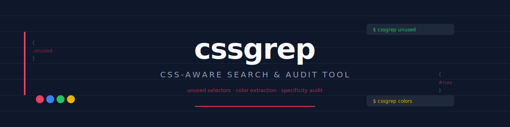

# cssgrep

<p align="center">
  
</p>

<p align="center">
  <a href="https://github.com/izag8216/cssgrep/actions/workflows/ci.yml">
    
  </a>
  
  
  
</p>

**cssgrep** is a zero-config CLI tool for auditing CSS. Find unused selectors, extract color palettes, and audit selector specificity -- all in one command.

No build integration required. Runs locally with no network calls.

## Features

- **Unused Selector Detection** -- Scan CSS against HTML to find selectors with no matching elements
- **Color Extraction** -- Extract, normalize, and catalog all colors across your stylesheets
- **Specificity Audit** -- Calculate W3C specificity scores and flag overly complex selectors
- **Multiple Output Formats** -- Pretty terminal output, tables, or JSON for CI integration
- **Zero Configuration** -- Works out of the box with sensible defaults

## Installation

```bash
# Global install (recommended)
npm install -g cssgrep

# Or use with npx (no install)
npx cssgrep unused --css "src/**/*.css" --html "public/**/*.html"

# Or install as a dev dependency
npm install --save-dev cssgrep
```

## Quick Start

```bash
# Find unused CSS selectors
cssgrep unused --css "src/**/*.css" --html "dist/**/*.html"

# Extract all colors from your stylesheets
cssgrep colors "src/**/*.css" --format hsl --output palette

# Audit selector specificity
cssgrep specificity "src/**/*.css" --threshold "1,3,3"
```

## Commands

### `cssgrep unused`

Detect CSS selectors that have no matching elements in HTML files.

```bash
cssgrep unused --css "src/**/*.css" --html "public/**/*.html"
cssgrep unused --css "dist/bundle.css" --html "index.html" --format json
```

| Option | Default | Description |
|--------|---------|-------------|
| `-c, --css <pattern>` | `**/*.css` | Glob pattern for CSS files |
| `-h, --html <pattern>` | `**/*.html` | Glob pattern for HTML files |
| `-f, --format <format>` | `pretty` | Output: `table`, `json`, `pretty` |

### `cssgrep colors`

Extract and normalize all color values from CSS files.

```bash
cssgrep colors "src/**/*.css"
cssgrep colors "theme.css" --format hsl --output palette --verbose
```

| Option | Default | Description |
|--------|---------|-------------|
| `-f, --format <format>` | `hex` | Normalization: `hex`, `rgb`, `hsl` |
| `-o, --output <output>` | `list` | View mode: `list`, `palette`, `stats` |
| `--include-keywords` | `false` | Include `inherit`, `initial`, etc. |
| `-v, --verbose` | `false` | Show source file and line per occurrence |
| `--fmt <format>` | `pretty` | Output format: `table`, `json`, `pretty` |

### `cssgrep specificity`

Calculate specificity scores and flag selectors above a threshold.

```bash
cssgrep specificity "src/**/*.css"
cssgrep specificity "critical.css" --threshold "1,3,3" --sort desc
```

| Option | Default | Description |
|--------|---------|-------------|
| `-t, --threshold <a,b,c>` | `2,4,5` | Specificity threshold (IDs, classes, tags) |
| `-s, --sort <order>` | `desc` | Sort by score: `asc`, `desc` |
| `-f, --format <format>` | `pretty` | Output: `table`, `json`, `pretty` |

## Programmatic API

```typescript
import { findUnusedSelectors, extractColors, analyzeSpecificity, scanFiles } from 'cssgrep';

const cssFiles = await scanFiles('src/**/*.css');
const htmlFiles = await scanFiles('public/**/*.html');

// Unused selectors
const unused = findUnusedSelectors(cssFiles, htmlFiles);

// Colors
const colors = extractColors(cssFiles, { colorFormat: 'hex', includeKeywords: false });

// Specificity
const highSpec = analyzeSpecificity(cssFiles, [2, 4, 5]);
```

## Documentation

- [Usage Guide](docs/usage.md)
- [API Reference](docs/api.md)

## Contributing

See [CONTRIBUTING.md](CONTRIBUTING.md).

## License

MIT License. See [LICENSE](LICENSE).

---

[English](README.md) | [日本語](README.ja.md)
